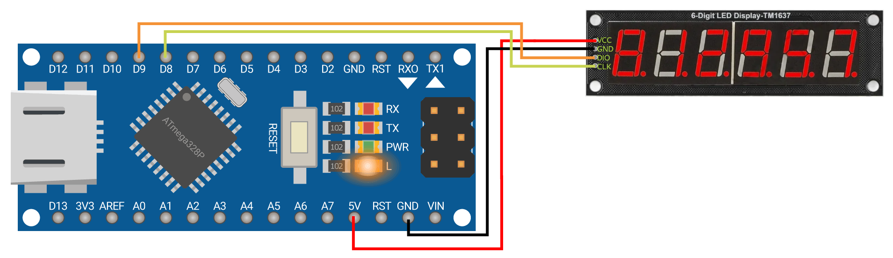
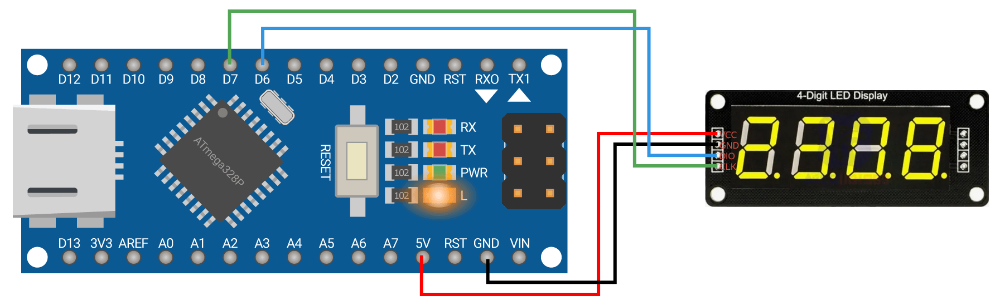
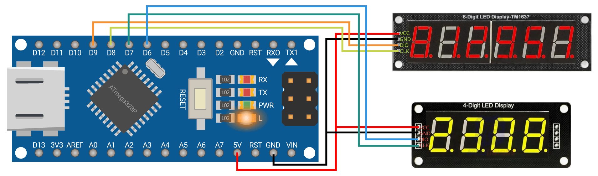

# TM1637_6Easy


**Языки:** [Русский](README.md) · [中文](README_CN.md)

Высокопроизводительная библиотека для 4- и 6-разрядных светодиодных дисплеев на базе **TM1637** для плат на ATmega328P (Arduino Uno, Nano, Pro Mini).

Тайминги протокола TM1637 сформированы тактовыми задержками на `nop`, а не `delayMicroseconds()`, а управление пинами идёт **напрямую через регистры** `PORTx` / `DDRx` / `PINx`. Благодаря этому библиотека стабильно работает на дешёвых клонах с **керамическим резонатором**, где решения на `digitalWrite()` могут давать сбои.

## ✨ Особенности

- ✅ **Прямая работа с регистрами** (`PORTx` / `DDRx` / `PINx`) — без `digitalWrite`
- ✅ **Задержка в протоколе — один `nop`** — не зависит от `F_CPU`
- ✅ **Таблица пинов в PROGMEM** — экономия RAM
- ✅ **Поддержка 4 и 6 разрядов**
- ✅ **Два порядка разрядов** для 6-разрядных модулей (нормальный / китайский)
- ✅ **Поддержка любых пинов**: D2–D13, A0–A5
- ✅ **Минимальные накладные расходы** — максимальная скорость протокола
- ✅ **Фатальные ошибки** — мигание встроенного светодиода PB5
- ✅ **Работает до `init()` Arduino** (мигание при фатальной ошибке)

## ⚙️ Требования и совместимость

- **Микроконтроллер:** ATmega328P (8-битный AVR).
- **Платы:** Arduino Uno, Nano, Pro Mini на ATmega328P. Другие AVR (например, Mega) требуют правки таблицы `PIN_MAP`.
- **Тактовая частота:** тайминги рассчитаны на **16 МГц** (стандарт для 5 В плат). На 8 МГц задержки удваиваются — работа возможна, но требует проверки.
- **Другие платформы** (ESP8266, ESP32, STM32): **не поддерживаются** — нет прямого доступа к регистрам AVR.

## 📦 Установка

### Способ 1: Через менеджер библиотек Arduino IDE (рекомендуется)

1. Откройте Arduino IDE
2. Перейдите в **Скетч** → **Подключить библиотеку** → **Управлять библиотеками...**
3. В поиске введите `TM1637_6Easy`
4. Нажмите **Установить**

### Способ 2: Вручную (через ZIP)

1. Скачайте ZIP-архив с [последней версией](https://github.com/klenov1900-lang/TM1637_6Easy/releases)
2. В Arduino IDE: **Скетч** → **Подключить библиотеку** → **Добавить .ZIP библиотеку...**
3. Выберите скачанный архив

### Способ 3: Через Git

```bash
cd ~/Arduino/libraries/
git clone https://github.com/klenov1900-lang/TM1637_6Easy.git
```

## 🔌 Подключение

### TM1637 → Arduino Nano

| TM1637 | Arduino |
|--------|---------|
| VCC | +5V |
| GND | GND |
| CLK | D2–D13, A0–A5 |
| DIO | D2–D13, A0–A5 |

### 📊 Допустимые пины

| Пины | Статус | Примечание |
|------|--------|------------|
| D2–D7 | ✅ МОЖНО | Цифровые пины PORTD |
| D8–D13 | ✅ МОЖНО | Цифровые пины PORTB |
| A0–A5 | ✅ МОЖНО | Аналоговые пины как цифровые (PORTC) |
| D0, D1 | ❌ НЕЛЬЗЯ | Заняты UART |
| A6, A7 | ❌ НЕЛЬЗЯ | Только аналоговый вход |

### 🎯 Рекомендуемые пины

```cpp
TM1637_6Easy display(8, 9, 3);    // CLK=D8, DIO=D9
TM1637_6Easy display(4, 5, 3);    // CLK=D4, DIO=D5
TM1637_6Easy display(A0, A1, 3);  // CLK=A0, DIO=A1
```

## 🚀 Быстрый старт

### 6 разрядов, китайский порядок



```cpp
#include "TM1637_6Easy.h"

TM1637_6Easy display(8, 9, 0);            // CLK=8, DIO=9, яркость=0

void setup() {
    display.begin(1);                     // 6 разрядов, китайский
    display.showNumber(123456);
    display.setDotOn(2);                  // точка в разряде 2
                                          // индикатор: [1][2][3.][4][5][6]
    display.update();
    delay(2000);
}

void loop() {}
```

### 4 разряда



```cpp
#include "TM1637_6Easy.h"

TM1637_6Easy display(7, 6, 0);            // CLK=7, DIO=6, яркость=0

void setup() {
    display.begin(2);                     // 4 разряда
    display.showNumber(1234);
    display.setDotOn(2);                  // точка в разряде 2
                                          // индикатор: [1][2][3.][4]
    display.update();
    delay(2000);
}

void loop() {}
```

### Два дисплея одновременно (4 и 6 разрядов)



```cpp
#include "TM1637_6Easy.h"

TM1637_6Easy display6(8, 9, 5);           // CLK=8, DIO=9, яркость=5
TM1637_6Easy display4(7, 6, 3);           // CLK=7, DIO=6, яркость=3

void setup() {
    display6.begin(0);                    // 6 разрядов, нормальный порядок
    display6.showNumber(1234);
    display6.update();

    display4.begin(2);                    // 4 разряда
    display4.showNumber(1234);
    display4.update();
}

void loop() {}
```

## 🎛️ Режимы

```cpp
display.begin(0);  // 6 разрядов, нормальный порядок (0,1,2,3,4,5)
display.begin(1);  // 6 разрядов, китайский порядок (2,1,0,5,4,3)
display.begin(2);  // 4 разряда
```

- Если у вас **самодельный модуль** — обычно `begin(0)`
- Если **китайский с AliExpress** — обычно `begin(1)`
- Если дисплей показывает цифры **не в том порядке** — попробуйте другой режим

## 📚 API

### Инициализация

| Функция | Разряды | Описание |
|---------|---------|----------|
| `begin()` | 6 | То же, что `begin(0)` |
| `begin(mode)` | 4/6 | `0`, `1` — 6 разрядов; `2` — 4 разряда |

### Основные

| Функция | Разряды | Описание |
|---------|---------|----------|
| `clear()` | 4/6 | Очистить буфер (`update()` не вызывает) |
| `update()` | 4/6 | Отправить буфер на дисплей |
| `setBrightness(0..7)` | 4/6 | Яркость |

### Вывод чисел

| Функция | Разряды | Описание |
|---------|---------|----------|
| `showNumber(n)` | 4/6 | **НЕ вызывает `update()`**. Требуется `display.update()`. Диапазоны: 4 разр. `-999..9999`, 6 разр. `-99999..999999`. Вне — `Err` или `-Err`. |

### Управление точками

| Функция | Разряды | Описание |
|---------|---------|----------|
| `setDotOn(pos)` | 4/6 | Включить точку |
| `setDotOff(pos)` | 4/6 | Выключить точку |
| `clearDots()` | 4/6 | Выключить все точки |
| `setDots(mask)` | 4/6 | Установить по маске |

> **Важно:** точки применяются только при `update()`. Если вы изменили точки после `showNumber()` (которая `update()` не вызывает), нужно вызвать `update()` вручную.

### Питание

| Функция | Разряды | Описание |
|---------|---------|----------|
| `displayOff()` | 4/6 | Погасить дисплей |
| `displayOn()` | 4/6 | Включить дисплей |

## ⚡ `showNumber` и точки

**Ключевое отличие:** `showNumber(n)` **НЕ вызывает `update()`** — это даёт возможность вручную управлять точками перед отправкой:

```cpp
display.showNumber(1234);
display.setDotOn(1);
display.update();       // ← без этого точки не появятся!
```

Порядок вызовов:

1. `showNumber(n)` — заполняет буфер цифрами
2. `setDotOn(pos)` / `setDotOff(pos)` — расставляет точки
3. `update()` — отправляет всё на дисплей

Номер разряда в `setDotOn` — это позиция на индикаторе слева направо, считая с нуля:

```
setDotOn(0) → [1.][2][3][4][5][6]
setDotOn(1) → [1][2.][3][4][5][6]
setDotOn(2) → [1][2][3.][4][5][6]
setDotOn(3) → [1][2][3][4.][5][6]
setDotOn(4) → [1][2][3][4][5.][6]
setDotOn(5) → [1][2][3][4][5][6.]
```

## 📊 Примеры использования

### Вывод числа с точкой (часы)

```cpp
display.showNumber(1234);
display.setDots(0b00000010);  // точка на позиции [1][2.][3][4]
display.update();
```

### Мигающая точка

```cpp
display.showNumber(1234);
if (dot_state) {
    display.setDots(0b00001000);  // точка на позиции [1][2][3][4.]
} else {
    display.clearDots();
}
display.update();
```

### Счётчик секунд

```cpp
void loop() {
    static uint32_t last = 0;
    if (millis() - last >= 1000) {
        last = millis();
        display.showNumber((millis() / 1000) % 100);
        display.update();
    }
}
```

## ⚠️ Отказоустойчивость

Библиотека **игнорирует отсутствие подтверждения от дисплея (NACK)**. Если модуль выйдет из строя, программа не зависнет, а просто будет отправлять данные «в пустоту». Текущие значения останутся в буфере и будут отображены после замены модуля.

### Фатальные ошибки

При фатальной ошибке дисплей не работает, а встроенный светодиод (**PB5, pin 13 на Nano/Uno**) мигает ~**3 Гц**.

**Причины:**

- `clk_pin == dio_pin`
- Пин вне диапазона `2..19`
- Использован `A6` или `A7` (только аналоговые входы)
- Не удалось назначить порты (внутренняя ошибка)

Плата **не выходит из этого состояния до перезагрузки**.

## 📝 История версий

| Версия | Дата | Изменения |
|--------|------|-----------|
| **v2.0.0** | 2026-09-19 | Полностью переработан API. Добавлена поддержка 4-разрядного дисплея. Обновлён README, добавлены примеры. |
| v1.0.2 | 2026-09-05 | Bump version to 1.0.2 |

## 📄 Лицензия

MIT License. См. [LICENSE](LICENSE).

## 📧 Контакты

- **Email:** gray_wolf19@mail.ru
- **GitHub:** [klenov1900-lang](https://github.com/klenov1900-lang)

---

⭐ Если библиотека вам полезна, поставьте звезду на GitHub! ⭐
